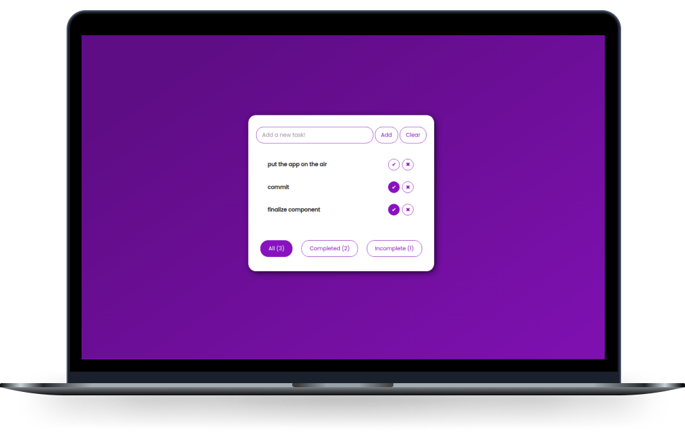

<h1 align="center">
  <strong>To-Do App from Svelte</strong>
</h1>

<p align="center">
  <a href="#-Technologies">Technologies</a>&nbsp;&nbsp;&nbsp;|&nbsp;&nbsp;&nbsp;
  <a href="#-Project">Project</a>&nbsp;&nbsp;&nbsp;|&nbsp;&nbsp;&nbsp;
  <a href="#-Use">Use</a>&nbsp;&nbsp;&nbsp;
</p>

<br>

<p align="center">
  <p align="center">
  
</p>

</p>

## 🚀 Technologies

This application was developed with the following technologies:

- HTML 5
- CSS 3
- JavaScript
- Svelte
- Cypress

## 💻 Project
<p>
    To-do app is a simple daily task listing system and was developed using the svelte framework. The purpose of this application is to help those who use it to organize their day-to-day tasks, however, its real objective was to help in the fixation of knowledge regarding the svelte framework as well as automated tests of interface with cypress.
</p>

## 💡 Use
### ✔ Try it
If you want to try it, <a target="_blank" href="https://to-do-svelte.netlify.app/">click here</a> to access the APP.

### ✔ Run the tests

- Clone the repository:

```bash
$ git clone https://github.com/ErnaneJ/To-Do_AppSvelte.git
```

- Install the dependencies

```bash
$ npm install
```
- Start a server on localhost

```bash
$ npm run dev
```
- Start cypress and select a test
```bash
$ ./node_modules/.bin/cypress open
```
##### * if you want to add some new test, add it to `./cypress/integration`. Make a pull request, I would love to receive your test, or even some other system improvement.
---

<p align="center">
Developed with ❤ by <a target="_blank" href="https://ernanej.github.io/my-linktree/">Ernane Ferreira</a>. 👋🏻<br/>
<small>Project developed with a personal and educational focus.<small>
</p>
